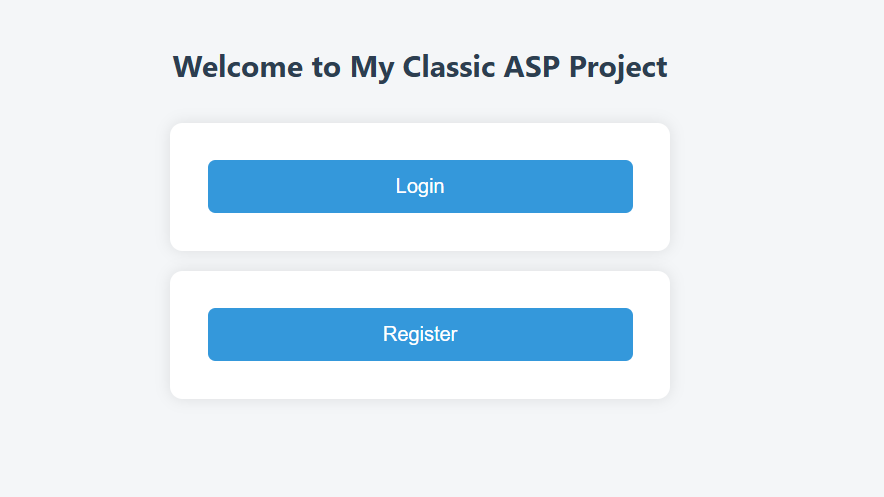
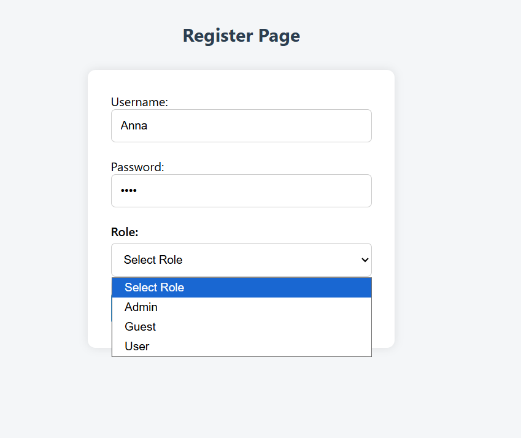
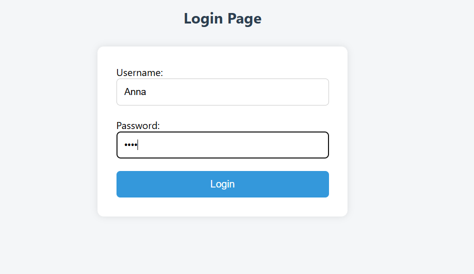
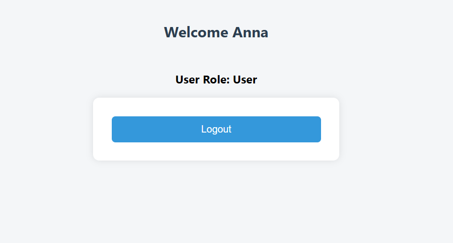
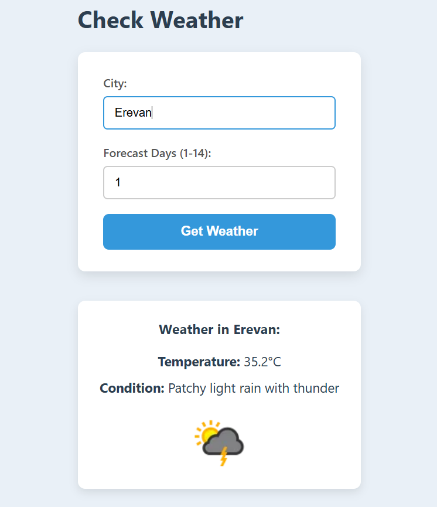

# MyClassicAspApp

A simple Classic ASP web application featuring user authentication, role-based access control, Microsoft SQL Server integration, and real-time weather display using an external API.

---

## 📁 Project Structure

- **`sql/00_create_db.sql`** – Contains the initial SQL script to create and configure the database schema.
- **`helpers/Crypto.Class.asp`** – Used for secure password hashing (borrowed from [as08/ClassicASP.PasswordHashing](https://github.com/as08/ClassicASP.PasswordHashing)).
- **`register/`, `login/`, `logout/`** – User registration, login, and logout logic.
- **`services/`** – Application services such as user and role handling.
- **`helpers/dbHelpers.asp`** – Generic database connection and query helper functions.

---

## 🔐 Features

- **User Registration & Login**
  - Secure password hashing (SHA256 + Base64)
  - Cookie-based session authentication
- **Role-Based Authorization**
  - Assign roles on registration
  - Restrict access to pages by role
- **User Logout**
  - Clears authentication cookies securely
- **Password Hashing**
  - Implemented via reusable `Crypto.Class.asp` from [as08/ClassicASP.PasswordHashing](https://github.com/as08/ClassicASP.PasswordHashing)
- **Logging**
  - Basic logging for key actions and errors

---

## 🛠️ Technologies Used

- Classic ASP (VBScript)
- Microsoft SQL Server
- ADO (ActiveX Data Objects)
- HTML/CSS

---

## 🚀 Getting Started

1. Import the SQL script from `sql/00_create_db.sql` into your MS SQL Server to initialize the database.
2. Make sure your IIS server is configured to run Classic ASP.
3. Place the project folder in your IIS root (e.g., `C:\inetpub\wwwroot\MyClassicAspApp`).
4. Update database connection strings in `dbHelpers.asp` if needed.
5. Visit `http://localhost/MyClassicAspApp` in your browser.

---

## 📝 License & Credits

- Password hashing module is based on work by [as08](https://github.com/as08/ClassicASP.PasswordHashing).

---

## 📸 Screenshots

### 🏠 Index Page

### 📝 Registration Page

### 👤 Login Page

### ✅ Logged In View

### ✅ Check weather In View

## ✅ Status

---

This project is complete as a basic user authentication and authorization system. Additional features such as password reset, user profile management, and admin dashboards can be built on top of it.
